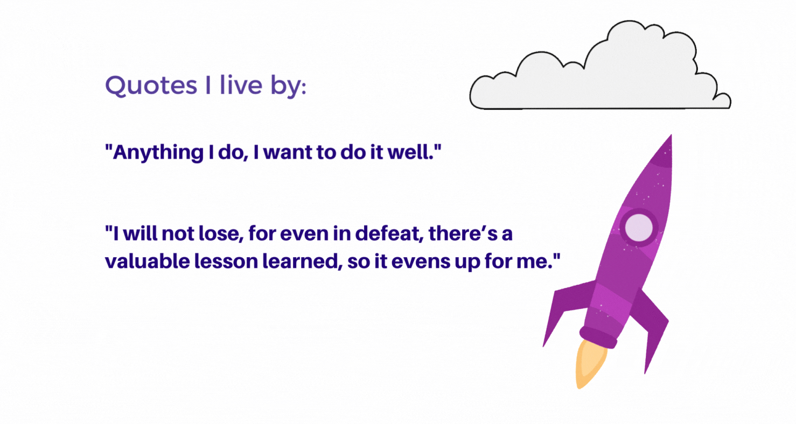

# Hello World! 👋

### I'm [Cypran](https://www.linkedin.com/in/cypranakubude/) and welcome to my GitHub profile! 👨‍💻
🖤 Fun facts:
- 👩‍🎓 Before switching to Data Analyst/Science, I was a finance and digital transformation enthusiast who got a Bachelor's Degree in Business Administration (Banking and Finance).
- ✍️ Completed my Master's Degree in International Business with a speciality in Digital Transformation Management from Cologne Business School. 
- 📖 Self-learning through IBM, Microsoft, DataCamp and Google Certification Programs to improve my knowledge as a data scientist.
- ✨ I seem to be spending too much time designing my code and GitHub markdown because I cannot stand having sloppy documentation.
- 📈 My long-term interests span across **`Artificial Intelligence`**, **`Machine Learning`** and applying statistical models to solve interesting business problems.
- 🌱 I’m currently learning Python
- 💞️ I’m looking to collaborate on GitHub
- 📫 How to reach me? Email
##
## 🛠 Languages/Tech Stack:

  

#

##
## 🖼️ Data Visualizations

<!---
CypranA/CypranA is a ✨ special ✨ repository because its `README.md` (this file) appears on your GitHub profile.
You can click the Preview link to take a look at your changes.
--->
